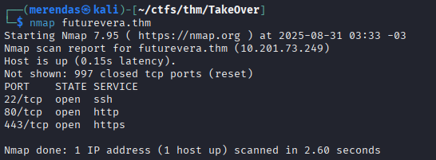
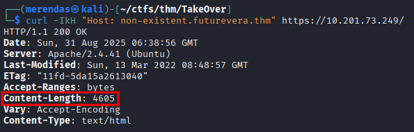
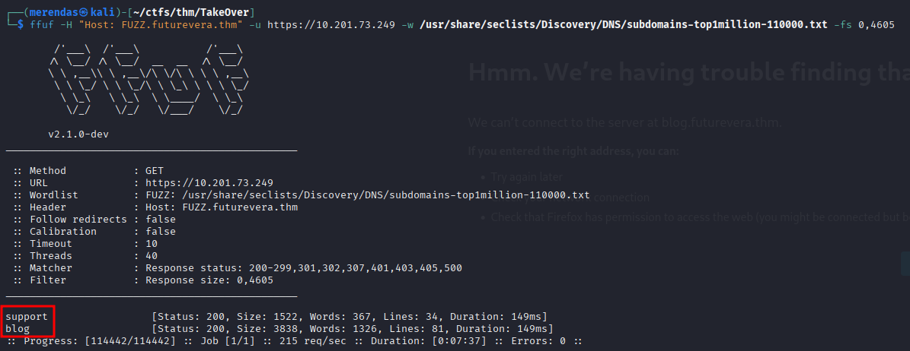
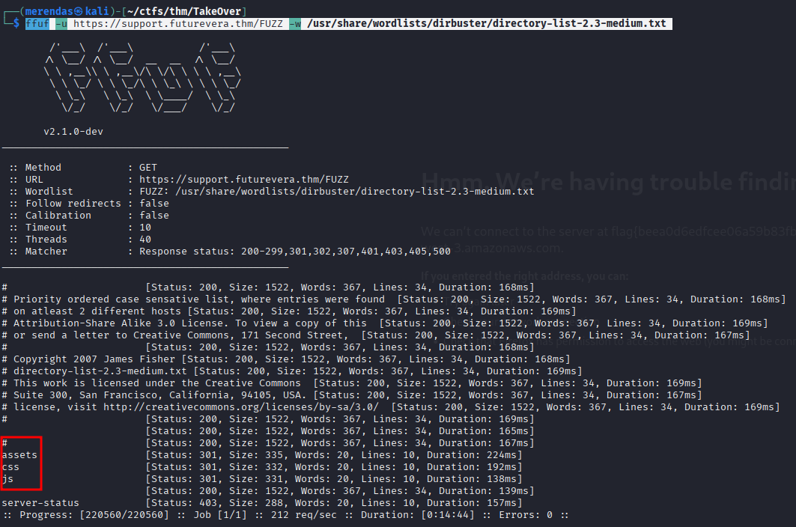
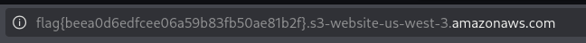

Machine's link: [TryHackMe | TakeOver](https://tryhackme.com/room/takeover)
# Description

Hello there,  
  
I am the CEO and one of the co-founders of futurevera.thm. In Futurevera, we believe that the future is in space. We do a lot of space research and write blogs about it. We used to help students with space questions, but we are rebuilding our support.  

Recently blackhat hackers approached us saying they could takeover and are asking us for a big ransom. Please help us to find what they can takeover.  
  
Our website is located at [https://futurevera.thm](https://futurevera.thm/)

Hint: Don't forget to add the MACHINE_IP in /etc/hosts for futurevera.thm ; )

# Solution
The name and description make us imagine that we're going to search an possible subdomain takeover.

Futhermore, the challenge says about subdomain enumeration.

With an basic nmap scan we have

To enumarete subdomains, I used FFuF.
To this, basically we start seeing the Content-Length of a request with a non-existent subdomain to the target. We can do this with the command:
	curl -IkH "Host: non-existent.futurevera.thm" https://{MACHINE_IP}/

Now we'll search for results that return something different from 4605. For this, we can do:
	ffuf -H "Host: FUZZ.futurevera.thm" -u https://10.201.73.249 -w /usr/share/seclists/Discovery/DNS/subdomains-top1million-110000.txt -fs 0,4605

Now, our focus will be exploring these two subdomains, blog and support.
These have already been mentioned, in the challenge description. Our main focus will be support (the one going under maintenence and problably with the failure).

First, lets add both on our /etc/hosts.

Now we can search the subdomains.
While trying to use gobuster, we got an error verifying the certificate (and the HTTP move us to futurevera.thm). So, lets running FFuF for this again while we search for the certificate.

The FFuF command now will be:
	ffuf -u https://support.futurevera.thm/FUZZ -w /usr/share/wordlists/dirbuster/directory-list-2.3-medium.txt

These directories didn't have anything who could be compromised.

The only clue we have while FFuF is running, is that gobuster was failing with the certificate in HTTPS.
So, lets examine the certificate!

Here we found an interesting thing!
Let's add this other subdomain to ours /etc/hosts

And we got it!!
if we try to access this name in HTTP, we are redirected to a AWS's S3 that does not exist with the flag, the one that the attackers could use to a takeover.

