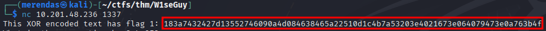
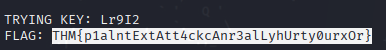
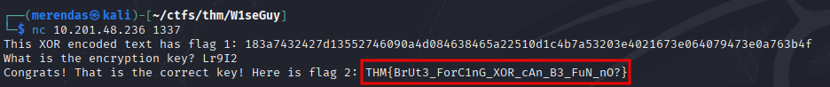

Machine's link: [TryHackMe | W1seGuy](https://tryhackme.com/room/w1seguy)

# Description
### Task 1: Source Code
Yes, it's me again with another crypto challenge!  

Have a look at the source code before moving on to Task 2.  
  
You can review the source code by clicking on the Download Task Files button at the top of this task to download the required file.

### Task 2: Get those flags!
Your friend told me you were wise, but I don't believe them. Can you prove me wrong?  

When you are ready, click the **Start Machine** button to fire up the Virtual Machine. Please allow 3-5 minutes for the VM to start fully.

The server is listening on port 1337 via TCP. You can connect to it using Netcat or any other tool you prefer.

Answer the questions below

What is the first flag?  

What is the second and final flag?

# Solution
Analyzing the source code, we saw that the flag is encrypted in the following way:
	flag -> XOR (with a random 5 characters key) -> hex
XOR is a two way encode, so you can reverse it. Since we don't have the key, we'll need a way to find it, but aint gonna be that hard since the key's length.
To solve this, I made a solver in python that basically bruteforce, looking for the pattern THM{ in the start.
But, THM{ has only 4 characters, so, the last digit I print all possibilities and look for the one that makes sense.
The solver source code is on this repo, feel free to use. The code ain't the best but is working! I was just not wanting to spending a lot of time on this.

So, with the solver, we connect to the target:

We enter this flag on our solver and receive this:

Inserting the key, we now got the other flag:

